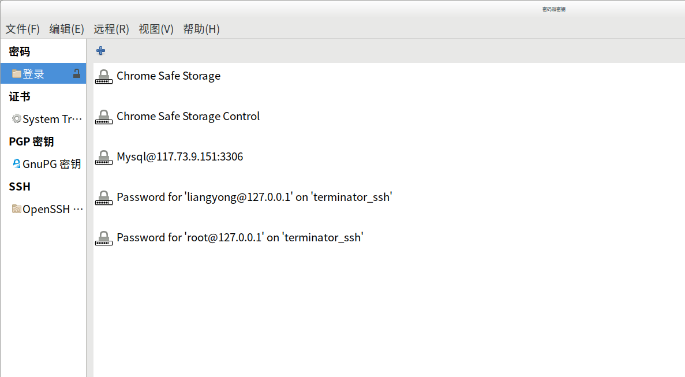

# my-terminator
terminator with autosuggestion


## 简介
本项目是在 terminator 1.91基础上，开发了自动提示功能的功能。 
zsh-autosuggestion使用起来实际上已经很方便了，但是zsh在个人电脑上安装居多，一般在其他服务器及sftp等情况下不能提示。  
此项目是在终端工具terminator基础上实现了扩展，  在ssh远程登录到服务器或者在sftp、redis等各类命令行下仍然可以进行提示。   
同时为了方便使用terminator来进行ssh连接，写了ssh连接插件，简单记录ssh配置及密码，自动打开新窗口创建ssh连接。

## 使用
### 自动提示的使用
请看gif图


### ssh连接配置
提供简单配置ssh连接功能，保存ip，用户名，密码，ssh端口号，右键默认展示最近使用的10个ssh连接供快速打开。  
请看gif图  


## 基本原理
主要有2个功能  

1、自动提示功能  
主要处理 vte的key-press-event 和commit事件和contents-changed 事件

处理key-press-event、 terminal_commit 事件，  
当有key-press和commit（也即敲击键盘输入内容）时判断输入是否是可见字符，最终引发contents-changed 事件后  
来决定是否应该展示命令提示框。
提示框位置跟随光标，在光标下方展示，当超出屏幕范围时，展示在光标上方
默认最多展示10条提示，可自己修改tip.py中的配置 SUGGESTION_NUM

当选择了提示命令后，根据匹配情况使用VT100控制码移动光标并插入选择的命令

处理 contents-changed 事件，获取光标位置记录 光标行列    
当 contents-changed  时，判读 当前光标的行数 与 之前行数 是否发生了变化，发生变化则认为是执行了命令引起了内容行数发生变化，  
通过 get_text_content 获取 之前行数 上的文本内容作为历史命令并记录。   

自动提示功能是基于历史输入来的，没记录过的命令无法提示。 
自动提示功能会根据历史输入记录，当历史记录中在某个情况下，输入一个命令后，紧接着输入过另一个则会自动弹出并选中第一个  
这样某些比较连贯的命令某些时候可以输入后直接Enter,Enter..... 目前此功能有些情况下还是可以用的。  

另外有 Shift+空格 快捷键，此快捷键会在当前行暂时关闭提示功能。  
如果感觉当前受到了干扰，可暂时关闭提示框，下一行会自动开启。

提示框非遮罩，在任何情况下，继续输入字符或粘贴都可以继续正常输入，提示框只会处理Up，Down，Enter三个键。  

2、ssh连接插件   
使用插件简单配置SSH连接，保存SSH密码，并右键快速打开
密码保存到密钥环 keyring，所以需要安装python依赖 pip install keyring
创建ssh连接时是先打开一个tab页，然后使用sshpass来自动连接。 所以需要安装sshpass依赖。

密码不是必填项，如果配置了免密登录，则可以不输入密码 

想看相关debug日志的，可开启tip.py和ssh_connect.py里的 DEBUG_ENABLE = True  
然后命令行下 terminator 来启动 terminator即可看到一些deug日志

## 安装方法
```
1、安装 terminator 1.91
terminator下载安装地址  https://pkgs.org/download/terminator
Ubuntu 18可以直接 apt-get install terminator  
Ubuntu 16下 apt-get install 安装的不是1.91版本，可从这个地址下载 terminator_1.91-1_all.deb 来安装1.91版本  
其他Linux操作系统的没测试过。 

安装后需要注意 terminator的安装目录  
一般Ubuntu使用apt或者deb安装包安装的情况下，位于  /usr/share/terminator  
还有的使用压缩包里的setup.py安装的话，可能位于 /usr/local/lib/python2.7/dist-packages/terminatorlib  
其他操作系统可能位于其他目录，如果是在其他目录下面步骤请注意替换相应目录。

2、 复制  terminal.py tip.py 到 /usr/share/terminator/terminatorlib 下即可  
        terminal.py将会覆盖原来的文件， tip.py是新文件

前面2步是关于自动提示功能的

3、安装python依赖 pip install keyring
4、安装sshpass
    Ubuntu:  apt-get install sshpass

5、复制 ssh_connect.py 到 /usr/share/terminator/terminatorlib/plugins目录下
        插件需要打开Terminator后启用这个插件才能正常使用。

这三步是关于ssh连接插件的，两者互不干扰。可只安装使用其中一个功能。
```

## 其他说明
terminator安装后建议把窗口下的带颜色的标题栏给去掉。


### 匹配模式
 1、startswith: 'cd b'' 匹配 'cd bin'  
 2、中间模糊匹配   'bi' 匹配 'cd bin'  
 3、命令完全匹配，变量模糊匹配  'cd i' 匹配 'cd bin'  

 ### 自动提示的推荐算法
 基于5个维度来计算得分，每个维度的得分都在0-1之间，总得分最高的排在前面    
 window title: 窗口标题  
 prefix：  命令输入的前缀，比如 sftp，比如 $PS1  
 precmd: 前一条输入    
count： 命令出现的总次数   
last_time: 命令出现的最后时间       

记录的历史命令总数大于一定数量时删除最早的部分，这样也可以遗忘掉很老的可能不再使用的历史命令    
这个推荐算法是我自己瞎琢磨的，肯定会有更好的算法。。。

### 历史记录的保存
历史记录保存于 $HOME/.terminator.db 这个sqlite数据库。  

### 删除错误记录
1、如果输入错误或bug导致记录历史有误，可右键 View Hostory查看历史，搜索并删除这一条输入错误的历史命令
因为 View Hostory 的目的就是为了删除错误命令的，因此只有总的记录次数小于5的才被搜索展示出来，并可以删除。
 

### ssh密码被保存在哪里了
比如Ubuntu操作系统下Chrome的自动保存密码功能实际上就是保存在Keyring里了    
在应用里搜索keyring或seahorse,中文下会显示搜索到 密码和秘钥（seahorse），打开可以看到    

实际上密码文件应该是位于 $HOME/.local/share/keyrings 下   

### Keyring可能带来的问题
通常情况下Keyring的"登录"密码就是账号登录密码，在登录桌面后自然而然就可以获取到Keyring里的密码。  
但是如果Keyring的"登录"密码与账号登录密码不一样的情况下，可能会出现点问题。
这种情况下可以修改Keyring的"登录"密码与账号登录密码一致即可。 


## 已知问题
VTE并没有现成的可靠的API可以获取输入及输出，还要处理很多特殊情况，因此自动提示功能并不十分正确。  
目前我个人只在Ununtu16、Ubuntu18上使用过，目前已知的问题  
1、比如处于top命令等类似场景下，   
       比如输入ls然后两次tab后，因为目前记录输入是记录当前行的最小列开始作为用户输入的命令。   
       最小列之前的字符串作为前缀。     
       输入ls再两次tab后，如果不主动把光标移动到最左，是不知道最左是在哪里的，则会从ls后面开始记录。    
       也可以记录最后的用户输入是tab并主动用VT100控制码来移动到最左再回到最右来针对性的解决这种情况，但是感觉没必要，不做了。   
2、自动提示功能对zsh的兼容不好，推荐使用bash   
3、换行的处理并不可靠，处于换行时历史记录可能会出错  
4、自动提示命令推荐的算法基于历史输入的统计，并不太智能。  
5、自动提示命令框可能有时候会对视线造成一点干扰，可Shift+空格暂时关闭。关闭后可Shift+空格在当前行再次开启。  
6、目前使用过程中并未发现性能问题，出现了自动提示缓慢的情况可以先调小tip.py里的最大历史记录数量再想办法解决性能问题。

## 参考

|  链接地址           |  说明       |    
|  :---------------------------------------------------------------------------------:  |  :-----------------------: |  
| http://www.climagic.org/mirrors/VT100_Escape_Codes.html     |   VT100控制码表  |  
| https://lazka.github.io/pgi-docs/index.html#Gtk-3.0                        |   Python GTK3.0  |  
| https://lazka.github.io/pgi-docs/index.html#Vte-2.91                      |   Vte 2.91                |  
| https://python-gtk-3-tutorial.readthedocs.io/en/latest/                  |   Python GTK+ 3 Tutorial    |  
| https://github.com/jaraco/keyring                                                             |   Keyring   |  

最后，老婆在卖茶叶，信阳毛尖（100/斤起）原产地发货，感兴趣的可加此微信。搬砖不易，感谢支持！勿喷，捂脸！


